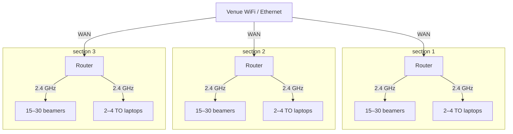

# Slippi Beamer

I currently have ONE working raspi beamer and ONE working ESP32 beamer. I have confirmed both can report sets succesfully with [my fork of replay reporter](https://github.com/jendotpg/replay-manager-for-slippi) (although the raspi firmware is now quite out of date...)

## TODO:

1. update tcp priorities
   1. always respond to mDNS requests first and foremost
   2. 503 when busy instead of not responding?

2. make "DRIVE FAILING", "WIFI ISSUE", "WIFI TOO FULL" errors instead of a warning
   1. a warning is either fixable OTA or usually ignorable. these three require physical intervention - they should be errors!

3. redesign screen:
   1. always show station name (unless error or booting)
   2. icon in the top-right for when there's an error state
   3. icon in the bottom-right for when there's a busy state

4. remove debug/zeros (its a nightmare and we already know what we wanted from it)
5. remove all the built-up timing + memory instrumentation. we don't really need it anymore. we can save it as a branch so that its easy to pull back what we want in the future.
6. support other boards with different pinouts? different build options, maybe?
   1. order and test Waveshare ESP32-S3-LCD-1.47 version

7. colorblind mode? blue instead of amber?

## Hardware

| Item                        | Detail                                                                                                                                                                                                                                             | Where I Source Them                                                                                                                    |
| --------------------------- | -------------------------------------------------------------------------------------------------------------------------------------------------------------------------------------------------------------------------------------------------- | -------------------------------------------------------------------------------------------------------------------------------------- |
| LilyGO T-Dongle-S3 with LCD | ESP32-S3 with 16 MB flash. Native 4-bit SDMMC, native USB OTG on a USB-A male plug, an addressable RGB status LED, a 0.96" 160×80 colour screen, and a transparent case. Get the variant with the screen if you can afford the extra dollar or so! | [www.amazon.com/dp/B0BK9162QY](https://www.amazon.com/dp/B0BK9162QY?lv=shuf&channelId=500&plpRedirect=mhFallback&th=1)                 |
| microSD card                | Any size from 4 GB up. Make sure to format the card to 4 GB FAT with 4 KB clusters.                                                                                                                                                                | [www.digikey.com/en/products/detail/htsemi/HTF016G3U1/29285793](https://www.digikey.com/en/products/detail/htsemi/HTF016G3U1/29285793) |
| Router                      | Only really needed if you have more than ~10 setups - otherwise, you can probably get away with venue wifi.<br /><br />One per section. Try to keep all setups within ~20 feet of the router.                                                      | [Choosing a router](#choosing-a-router)                                                                                                |

## Setting up a new Beamer

1. Format your microSD card - FAT32, first partition sized at 4GB (or smaller).
2. Insert the microSD card into the dongle. Note: The microSD slot is INSIDE the usb jack! Remove the dummy card that comes inside to insert the new one.
3. Hold the button on the side of the board dongle while you plug it into your laptop, then let go. Navigate to [the flashing page](https://jendotpg.github.io/slippi-beamer/) and press flash.
   1. "Leaving..." means its done - you don't have to wait any longer!
   2. This only works on Chrome, sorry. If you don't want to install Chrome, you can flash using `espup`or `cargo` - see [firmware build](#build)

4. Unplug and replug the dongle to leave download mode. The first boot derives the station identity and lays down `CONFIG/` and `LOGS/`
5. Fill in `CONFIG/config.txt` with SSID, Password, and Station Name.
   1. See [Configuring a station](#configuring-a-station) for more details on this file.
   2. Watch the screen/LED. If it goes green and shows the station name your Beamer is working and ready to go! Otherwise, you probably entered the wifi wrong. This will look like a really really really long boot followed by a screen that says "WIFI ISSUE". Other errors will also show on screen - just read it and consult the [error list](#error-labels) or [warning list](#warning-labels)

## Configuring a station

You can configure a Beamer by editing`CONFIG/config.txt`. It's read in full at boot and again after any edit. Keys are case-insensitive, blank lines and `#` comments are ignored, and values may be quoted. Config files larger than 4kb are rejected.

| Key                  | Default        | What it does                                                                                                                                              |
| -------------------- | -------------- | --------------------------------------------------------------------------------------------------------------------------------------------------------- |
| `SSID`               | blank          | The network to join.                                                                                                                                      |
| `PASSWORD`           | blank          | 8–63 characters. Blank means an open network.                                                                                                             |
| `COUNTRY`            | `US`           | Two-letter regulatory domain:`US`, `CA`, `JP`, `GB`...                                                                                                    |
| `HIDDEN`             | `false`        | Whether the network broadcasts its name.                                                                                                                  |
| `STATION-NAME`       | the station ID | What to call this station. Appears as`station_name` in `GET /status` and as the station's hostname.                                                       |
| `NUM-REPLAYS-SERVED` | `10`           | How many of the newest replays the station hands out over HTTP. 1 to 16.                                                                                  |
| `REPLAY-CAP`         | `512`          | How many replays the station counts on the card before it stops counting. 1 to 512. Past 75% it warns; at the cap it warns and stops serving new replays. |
| `LED-BRIGHTNESS`     | `20`           | The status LED, 0 to 100 percent.                                                                                                                         |
| `FLIP-SCREEN`        | `false`        | Whether the screen starts rotated 180 degrees. The button on the side of the dongle flips it either way at any time.                                      |
| `DEBUG`              | `false`        | Debug mode. Don't use this unless you know what you're doing.                                                                                             |

## Networking

Split the venue into sections of up to ~30 setups. Each section gets one router and pool captains can only see Beamers in their section. Each setup should be within ~20 feet of the router - any further will slow things down for your pool captains.

Beamers have no password of any kind so anyone who can reach one can fuck with it. Be aware of this if you choose to use venue Wifi instead of bringing your own router :P



### Router settings

Whenever your venue will let you run ethernet cables to each section, do so - it will make everything faster!

#### Venue offers no ethernet

| Setting   | Value                                                     | Per section |
| --------- | --------------------------------------------------------- | ----------- |
| Mode      | Router - wireless WAN (sometimes called WISP or repeater) | identical   |
| WAN       | Source wifi, 5 GHz band                                   | identical   |
| SSID      | `section-N`                                               | **unique**  |
| LAN       | `10.N.0.0/24`                                             | **unique**  |
| 2.4 GHz   | the venue's least-contended channel                       | identical   |
| 5 GHz     | taken by the wan                                          | identical   |
| DHCP      | on - pool >= 40 - reserve every station by MAC            | identical   |
| Isolation | off                                                       | identical   |

#### Venue offers ethernet

| Setting   | Value                                          | Per section |
| --------- | ---------------------------------------------- | ----------- |
| Mode      | Router                                         | identical   |
| WAN       | Ethernet                                       | identical   |
| SSID      | `section-N`                                    | **unique**  |
| LAN       | `10.N.0.0/24`                                  | **unique**  |
| 2.4 GHz   | the venue's least-contended channel            | identical   |
| 5 GHz     | the venue's least-contended 5 GHz channel      | identical   |
| DHCP      | on - pool >= 40 - reserve every station by MAC | identical   |
| Isolation | off                                            | identical   |

### Choosing a router

If your venue has ethernet that you can wire to each section, don't fret about this - literally any router with **256MB RAM** (that's most of them) will do! Get whatever is cheapest. If your section has <15 setups, don't even worry about the RAM requirement - 128MB will likely do fine!

If you want a router that works even when the venue has no ethernet, you'll need one that supports **wireless WAN with NAT**. Most consumer routers can't do this. Make sure to get a router with **256MB RAM** otherwise connections can start to drop past about ~15 setups. Don't worry about other router features, they won't buy you any improvement! Suggestions:

- GL.iNet Opal (GL-SFT1200) - ~$39. **Recommended for sections with 5-15 setups**
- GL.iNet Beryl AX (GL-MT3000) - ~$99. **Recommended for sections with 15-25 setups**
- GL.iNet Flint 2 (GL-MT6000) ~$169. **Recommended for sections with 25+ setups**
- Any secondhand OpenWrt-capable router with 256MB of RAM. Netgear R7800 and Linksys WRT1900AC are common suggestions. If the stock firmware doesn't support wireless WAN with NAT (often called WISP mode), OpenWrt will - but you'll have to flash it yourself!

## HTTP API

All responses are JSON. There is no authentication: anyone who can reach the station over HTTP can drive this API.

| Method | Path             | What it does                                                                             |
| ------ | ---------------- | ---------------------------------------------------------------------------------------- |
| `GET`  | `/status`        | The last status report, straight off the two fragments. Runs nothing, so poll it freely. |
| `POST` | `/status`        | Re-runs the scan tick, then returns the fresh report.                                    |
| `GET`  | `/SLIPPI/`       | Index of the replays this station is currently serving. See[Publishing](#publishing).    |
| `GET`  | `/SLIPPI/<file>` | The replay itself.                                                                       |
| `POST` | `/reset-beamer`  | Wipes the replay drive. Requires`X-Beamer-Confirm: reset`.                               |

Setting `DEBUG` can sometimes add endpoints under `/debug/` - they're for me! If you want to read the code and use them تَفَضَّلِي, but don't rely on them keeping the same shape or even existing on a new release.

### Discovery

Every station advertises `_beamer._tcp` on port 80 over mDNS with the instance name as its hostname.

### `GET /status`

Everything here is cached by the scan tick so this `GET` is very cheap - **it's the pollable endpoint**.`POST` the same URL to rescan on demand.

```json
{
  "schema": 1,
  "arch": "esp32",
  "firmware_version": "v0.2.2",
  "station_id": "3f2a...", # beamer uuid against factory mac address
  "station_name": "stream station 2",
  "ssid": "nycmelee",
  "rssi": -58,
  "phy_mode": "HT20",
  "channel": 6,
  "replay_count": 47, # how many replays are stored - NOT how many are being served!
  "replay_cap": 512,
  "ssh": false, # always false
  "game": {
    "live": false, # whether this game is still in progress
    "ports": [
      {
        "port": 1,
        "char": "Puff", # human readable
        "char_id": 15, # matches replay-manager-for-slippi numbering
        "color": null, # human readable, null for default
        "costume": 0, # matches replay-manager-for-slippi numbering
        "nametag": null
      },
      {
        "port": 4,
        "char": "Falco",
        "char_id": 20,
        "color": null,
        "costume": 0,
        "nametag": null
      }
    ]
  },  # game is null until a game has been started
  "secs_since_port_change": null, # how long have just these ports been in use
  "secs_since_character_change": null, # how long has this ports+characters combo been in use
  "health": "ok", # ok, starting, warn, or errror
  "warnings": []
  # note the lack of "errors" array - errors mean the beamer is no longer functioning, so it has to be dealt with physically anyway!
}
```

### `GET /SLIPPI/`

Not re-rendered on request - this is also a cheap and acceptable endpoint to poll. Doesn't include the game that's still being written.

```json
{
  "schema": 1,
  "station_id": "3f2a...",
  "served_replay_count": 2,
  "files": [
    {
      "size": 412393,
      "url": "/SLIPPI/Game_20260814T181203.slp"
    }
  ]
}
```

A few notes:

- `served_replay_count` is how many replays are **being served**; contrast`replay_count`in `GET /status` which is how many are on the drive
- Only `*.slp` are listed or served and filenames can't have spaces or certain special characters - this is meant for reading off of a Wii. Details are at `publish.rs::is_replay_name`.

### `GET /SLIPPI/<file>`

A few notes:

- Accepts `Accept-Encoding: gzip` (body comes back `Content-Encoding: gzip` with no `Content-Length`)
- `X-Replay-From: <n>` is the gzipped resume path. `n` counts uncompressed bytes. Answers `200` with `X-Replay-From` in the return header.
- `Range` answers `206` and is the uncompressed resume path. Gzip and `Range`are mutually exclusive - `Range`wins when both are present.

### API Odds and ends

`GET /` returns `403`. This is expected and intentional.

Posts can be refused with `409` - this is expected, handle it smoothly in application code. The beamer won't reset the drive while a game is live, so backoffs for that endpoint should be LONG.

## Testing without a station

Everything a beamer application sees is an mDNS advertisement and five HTTP endpoints. We ship a script to offer this locally as a fake beamer.

```bash
tools/fake-beamer.py --name beamer-stream-1 --port 8081 --replays ~/slp/stream1 --game ~/slp/live.slp
```

`--game` is peeked out of a real `.slp`.Run several on different ports to simulate a fleet. `--unhealthy` and `--unreported` produce the two known failure states of `/status`.

## Beamer firmware

### Build

Build requires the esp-rs toolchain and ESP-IDF. If you dont have them installed:

```bash
cargo install espup espflash ldproxy
espup install
```

`espup` installs the xtensa Rust fork as a rustup toolchain and **writes `~/export-esp.sh`, which has to be sourced in each new shell**. `ldproxy` is needed for linking.

To build:

```bash
source ~/export-esp.sh
cargo build --release
```

To build and flash onto a beamer in download mode:

```bash
source ~/export-esp.sh
cargo run --release
```

**Editing `components/` does not, on its own, force cargo to rebuild the C code. If you edit C code your first rebuild will fail.`build.rs` deals with this this for you - just run the build again and it will work the second time.**

### Status Readout

**Blinking means something is happening - DO NOT UNPLUG.**

| Screen                                                         | LED Pattern                       | Meaning                                                        | Safe to Unplug? |
| -------------------------------------------------------------- | --------------------------------- | -------------------------------------------------------------- | --------------- |
| Loading circle                                                 | Blinking (**green**)              | Booting.                                                       | no              |
| Station name                                                   | Solid (**green**)                 | Healthy and idle.                                              | yes             |
| Warning label                                                  | Solid (**amber**)                 | Warning and idle.                                              | yes             |
| `WRITING` or `SENDING`, with moving dots, over `DO NOT UNPLUG` | Blinking (**green** or **amber**) | Doing something - don't unplug. If amber, there's a warning :P | no              |
| Error label                                                    | Solid (**red**)                   | Unhealthy.                                                     | yes             |
| Dark, backlight off                                            | Solid (**red** or **off**)        | Stopped.                                                       | yes             |

### Error labels

| Label           | What happened                                                                                                                        |
| --------------- | ------------------------------------------------------------------------------------------------------------------------------------ |
| `NO ID`         | The board's factory MAC is unset or all zeroes.<br /><br />**This is a board-side hardware issue.**                                  |
| `NO SD CARD`    | The card slot came up empty or no card responded.<br /><br />**This is probably a microSD card hardware issue.**                     |
| `SD UNREADABLE` | A card is present but its filesystem will not mount.<br /><br />**This is probably a microSD card hardware issue.**                  |
| `WRONG FORMAT`  | A card is readable but has no FAT32 partition or a first FAT32 partition bigger than 4 GB.<br /><br />**Reformat the microSD card**. |
| `NO CONFIG`     | `CONFIG/config.txt` could not be read. <br /><br />**Fix config.txt.**                                                               |
| `BAD CONFIG`    | The config file was read and rejected.<br /><br />**Fix config.txt.**                                                                |
| `NO USB`        | The USB stack would not start.<br /><br />**This is a board-side hardware issue.**                                                   |
| `NO WIFI`       | The ESP32 radio refused to start.<br /><br />**This is a board-side hardware issue.**                                                |
| `NO HTTP`       | Nothing is being served over HTTP<br /><br />**DM me @jenpissgirl on Discord...**                                                    |
| `NO MDNS`       | mDNS is not being offered<br /><br />**DM me @jenpissgirl on Discord...**                                                            |
| `OUT OF MEMORY` | Beamer ran out of Memory<br /><br />**DM me @jenpissgirl on Discord...**                                                             |
| `CRASHED`       | The firmware panicked somewhere.<br /><br />**DM me @jenpissgirl on Discord...**                                                     |

### Warning labels

| Label           | What is off                                                                                                                                                                                                                                                                                                                           |
| --------------- | ------------------------------------------------------------------------------------------------------------------------------------------------------------------------------------------------------------------------------------------------------------------------------------------------------------------------------------- |
| `DRIVE FAILING` | The card has stopped answering reads. Replays are still recorded, but not counted or served.<br /><br />**Replace your microSD card - it's reached the end of its life.**                                                                                                                                                             |
| `DRIVE FULL`    | `REPLAY-CAP` replays are on the card. New ones are no longer served.<br /><br />**Reset drive.**                                                                                                                                                                                                                                      |
| `NO WII`        | Nothing has read this drive in ten seconds. Usually this just means your beamer is plugged into a charger, a dead port, or a linux box that never mounted it.<br /><br />**If this beamer is plugged into a Wii: bad USB port.<br /> Otherwise ignore.**                                                                              |
| `SLP MISFORMAT` | A replay on the card will not parse. It is counted but never served; the station is otherwise fine.<br /><br />**Probably either a Slippi Nintendont software issue or Wii USB port hardware issue. <br />Ignore it once or twice - if it keeps coming up, try a different port.**                                                    |
| `DRIVE FILLING` | The card is past 75% of`REPLAY-CAP`. Delete replays before it stops serving new ones.<br /><br />**Reset drive.**                                                                                                                                                                                                                     |
| `WEAK LINK`     | The wifi signal is weak.<br /><br />**Move the router closer to this setup. <br />Sometimes ignorable - the more full your venue, the more worried you should be about this.**                                                                                                                                                        |
| `WIFI ISSUE`    | The wifi won't connect.<br /><br />**Usually this just means you put the wrong WiFI password. Fix config.txt. If that wasn't the issue, move the router closer to this setup. The beamer antenna is not as strong as the ones in your phone and laptop!**                                                                             |
| `WIFI TOO FULL` | The wifi connected but didn't issue an IP address - usually this means there are too many devices connected to the router.<br /><br />**Get your own router - see [choosing a router](#choosing-a-router). Sorry, the venue's router isn't cutting it for your tournament anymore. Tournament too big - good problems to have, huh?** |
| `LOW MEMORY`    | Not enough heap to take another connection. Replays are refused with`503` until there's space.<br /><br />**Beamer is getting hammered pretty hard.<br />Ignore it once or twice - if it keeps happening, too many people are connecting to your beamer. Split into smaller sections.**                                               |

### FAT cache

USB hosts typically cache FAT directories pretty aggressively. Writing a directory entry straight to the card while a host is holding the USB will almost always lead to desynchronized states between the host and the actual drive - this causes all sorts of issues with writing over used sectors, unlinked files, etc. **As a rule, once a host has connected the FAT volume is read-only to beamer firmware**. The firmware writes to the volume in exactly two windows, both when no host holds the medium:

1. Before the USB bind at boot, which is why the config is read early rather than when it is first needed.
2. After the host ejects, which is a clean SCSI media-change the firmware is told about.

Everything else is strictly read-only and re-reads the FAT rather than caching any directory entries.

### Memory

**Dynamic allocation follows a strict rule: never allocate a block larger than 512B once the station is `Running` unless the station can stay fully operational if that allocation fails.** Prefer moving large allocations off the heap wherever possible. In Rust, this usually means `static` or `heapless` - in C it usually means a file-scope `static`. Exceptions can be made in debug mode(`journal`'s log tail is currently the only one).

#### Allocated statically at link time

| Consumer                     |       Bytes | Description                                                                                                                                                                                              |
| ---------------------------- | ----------: | -------------------------------------------------------------------------------------------------------------------------------------------------------------------------------------------------------- |
| ESP-IDF and its libraries    |      43,540 | WiFi/PHY/supplicant 12,314, FreeRTOS 4,732 (mostly`port_IntStack`), the `esp-idf-*` crates 1,843, Rust `std`/`core` 1,643, lwIP 335, a 16,474 tail, and 6,199 of padding                                 |
| `beamer_wbc.c` `s_data`      |      32,768 | the write-back cache itself:`WBC_SECTORS=64`sectors of 512 B each                                                                                                                                        |
| `beamer_gz.c` `s_arena`      |      15,360 | zlib allocations over a 1 KB window                                                                                                                                                                      |
| `beamer_wbc.c` `s_staging`   |       8,192 | write back cache flush space                                                                                                                                                                             |
| `beamer_msc.c` `s_ring`      |       8,192 | 512 transfer timings - used to track read / write time on SD cards                                                                                                                                       |
| `beamer_log.c` `s_ring`      |       8,192 | the`esp_log` capture that becomes `LOGS/debug_N.txt`, 4,096 B of it kept per boot with the oldest lines dropped.<br /><br />because this is allocated at link time, `DEBUG=false` does not give it back. |
| `lcd.rs` `SCRATCH`           |       7,680 | 160×24 band of the led panel                                                                                                                                                                             |
| `http.rs` `SCRATCH`          |       6,144 | a 2 KB read chunk off the card and a 4 KB block of compressed output                                                                                                                                     |
| `scan.rs` `seen` + `present` |       4,160 | `REPLAY-CAP` filename hashes and presence bitmap                                                                                                                                                         |
| `http.rs` `BODY_BUF`         |       4,096 | `GET /status` or `GET /SLIPPI/` body                                                                                                                                                                     |
| `publish.rs` `index_buf`     |       2,560 | replay index json                                                                                                                                                                                        |
| `errors.rs` `STORE`          |       7,210 | the session, late and previous error blobs at`CAP` each, plus the summary being constructed                                                                                                              |
| `reload.rs` `SCRATCH`        |       4,096 | `config.txt`                                                                                                                                                                                             |
| `scan.rs` `FAST.game`        |       1,024 | the published game blob                                                                                                                                                                                  |
| `journal.rs` `ENCODE_BUF`    |         861 | the NVS summary blob                                                                                                                                                                                     |
| TinyUSB`_mscd_epbuf`         |       2,048 | `CFG_TUD_MSC_EP_BUFSIZE`(TinyUSB endpoint data buffer)                                                                                                                                                   |
| `beamer_msc.c` `s_stack`     |       6,144 | `beamer_msc` task stack                                                                                                                                                                                  |
| `beamer_wbc.c` `s_stack`     |       4,096 | `beamer_wbc` flush task stack                                                                                                                                                                            |
| `beamer_wbc.c` `s_meta`      |         768 | 64 slot descriptors                                                                                                                                                                                      |
| everything else              |       4,029 |                                                                                                                                                                                                          |
| **Total**                    | **167 KiB** |                                                                                                                                                                                                          |

#### Allocated once at boot

| Consumer                                                                                                                                                                        |        Bytes |
| ------------------------------------------------------------------------------------------------------------------------------------------------------------------------------- | -----------: |
| ESP-IDF's tasks (main 8,704, TCP/IP 3,584, esp_timer 4,096, event 2,816, IPC ×2 2,560, idle ×2 3,072, FreeRTOS timer 2,048, WiFi ~3,584, mDNS 4,096, httpd 8,192) plus ~13 TCBs |      ~53,000 |
| Firmware tasks: journal log 4,096, scan 8,192, net 8,192, status 4,096. The journal drain's 8,192 joins them only when`DEBUG` is set                                            |       24,576 |
| WiFi (minus the`.bss` portion)                                                                                                                                                  |       21,950 |
| httpd's lwIP pools and loopback control socket                                                                                                                                  |        5,508 |
| mDNS (minus the`.bss` portion)                                                                                                                                                  |        1,932 |
| NVS page cache                                                                                                                                                                  |       ~3,000 |
| The read window's FatFs registration                                                                                                                                            |        2,220 |
| The rendered reset census, two short lines held for the boot                                                                                                                    |         ~250 |
| Journal drain task (only when`DEBUG=true`)                                                                                                                                      |        8,192 |
| **Total**                                                                                                                                                                       | **~118 KiB** |

#### Allocated by lwIP

| Consumer                                     |      Bytes |                                                                          |
| -------------------------------------------- | ---------: | ------------------------------------------------------------------------ |
| One queued TCP segment                       |      1,536 | a`pbuf` of 16+56+1440 and a `tcp_seg` of 16, each +4 for TLSF            |
| One connection's send queue,`SND_BUF` 11,520 |     12,288 | 8 segments;`LWIP_NETIF_TX_SINGLE_PBUF` rounds every one up to a full MSS |
| **Both sockets,`max_open_sockets` = 2**      | **24,576** | what serving actually costs, since replay bytes fill every segment       |

#### Summary

|                                       |      Bytes |
| ------------------------------------- | ---------: |
| Total SRAM                            |    512 KiB |
| ...instruction cache and ROM reserved |     80 KiB |
| ...IRAM, the firmware's own code      |     94 KiB |
| ...allocated statically at link time  |    167 KiB |
| ...left for the heap                  |    171 KiB |
| Allocated once at boot,`DEBUG=false`  |   ~110 KiB |
| ...`DEBUG=true`                       |   ~118 KiB |
| Allocated by lwIP while serving       |  12-24 KiB |
| Free heap at rest                     | ~50-60 KiB |
| Free heap while serving               | ~25-50 KiB |
| Largest free block at rest            |    ~31 KiB |
| Largest free block while serving      |   ~7.5 KiB |

### Firmware odds and ends

#### Card size

Format the replay partition (the first FAT32 partition) to about 4 GB with 4 KB clusters. If you don't do this, shit breaks.

#### Fleet determinism

A station's behaviour must be a function of its config file and nothing else.

#### The RAM write-back cache

32 KB of internal SRAM sits between the host and the card. Writes land in RAM and return immediately while a draining task moves those cached sectors onto the card. This shields hosts from the SD card stalls (which can honestly be quite frequent). While a sector is dirty, ejects can seriously mess up the state of the microSD card. This is why there are `BUSY` states to tell TOs not to unplug.

Errors quiesce the cache before the LED turns red by switching to write-through - that way an error'd beamer can be safely pulled without ejecting.

#### FreeRTOS tasks

I really make an effort to keep this table up to date - it's not trivially self documenting.

| Task                        | Priority               | Core | Created at                           |
| --------------------------- | ---------------------- | ---- | ------------------------------------ |
| `beamer_msc`                | 22                     | 1    | `components/beamer_msc/beamer_msc.c` |
| `beamer_wbc`                | 10                     | 1    | `components/beamer_msc/beamer_wbc.c` |
| `httpd` (`esp_http_server`) | 5                      | 0    | `src/net/http.rs`                    |
| `net`                       | 4                      | 0    | `src/net/mod.rs`                     |
| `scan`                      | 4                      | 0    | `src/scan.rs`                        |
| `status`                    | 3                      | 0    | `src/status/mod.rs`                  |
| `journal` (DEBUG only)      | 1                      | 1    | `src/journal.rs`                     |
| `jrnl-log`                  | 1                      | 1    | `src/journal.rs`                     |
| `main`                      | 1, the ESP-IDF default | 0    | `CONFIG_ESP_MAIN_TASK_AFFINITY_CPU0` |

#### Station Identity

Each board assigns itself a `station_id` at first boot: a UUIDv5 over the chip's factory-programmed base MAC (hashed as lowercase colonless hex) against a fixed project namespace. Reflashing a board thus keeps the same `station_id`.

The hostname comes from `STATION-NAME`, which itself comes from`config.txt`. The hostname is slugged and `beamer-` is prefixed to it. `Stream Station 2` becomes `beamer-stream-station-2`. Some names don't slug clenly and fall back to `station_id`. For example,`STATION-NAME=拉拉`is a perfectly valid station name and works great with`GET /status`- but it would slug empty, so that station's hostname is `beamer-$UUID`. Nothing enforces hostname or `STATION-name` uniqueness: two stations named `Setup 2`claim the same hostname the same way two hosts on any network would. The `station_id` stays unique and can be used to distinguish them application-side.
