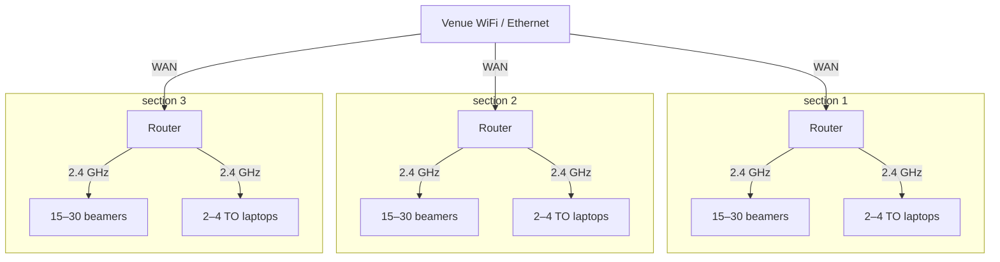

# Networking

Depending on how your tournament is set up, you may want TOs to see just Beamers in their section (Sharded) or to see every Beamer at the event (Connected). Either way, split the venue into sections of up to 30 setups each with their own router. Each setup should be within ~20 feet of the router. Whenever your venue will let you run ethernet cables to each section, do so - it will let you put laptops on 5GHz, which is a significant speedup!

### Buying routers

If your venue has ethernet that you can wire to each section, don't fret about this - literally any router with **256MB RAM** (that's most of them that aren't like .... travel routers) will do! Get whatever is cheapest. If your section has <15 setups, don't even worry about the RAM requirement - 128MB will likely do fine!

If you want a router that works even when the venue has no ethernet, you'll need one that supports **wireless WAN with NAT**. Most consumer routers can't do this out of the box. Make sure to get a router with **256MB RAM** otherwise connections can start to drop past about ~15 setups. Don't worry about other router features, they won't buy you any improvement! Suggestions:

- GL.iNet Opal (GL-SFT1200) - ~$39. **Recommended for sections with 5-15 setups**
- GL.iNet Beryl AX (GL-MT3000) - ~$99. **Recommended for sections with 15-25 setups**
- GL.iNet Flint 2 (GL-MT6000) ~$169. **Recommended for sections with 25+ setups**
- Any secondhand OpenWrt-capable router with 256MB of RAM. Netgear R7800 and Linksys WRT1900AC are common suggestions. If the stock firmware doesn't support wireless WAN with NAT (often called WISP mode), OpenWrt will - but you'll have to flash it yourself! **This is usually the cheapest option, but will require some technical know-how.**

### Sharded sections

**Pool captains can only see Beamers in their section**.

#### Venue offers no ethernet

| Setting   | Value                                                | Per section |
| --------- | ---------------------------------------------------- | ----------- |
| Mode      | Router - repeater (also called WISP or wireless WAN) | identical   |
| WAN       | Source wifi, 5 GHz band                              | identical   |
| SSID      | `beamer-N`(this is really just a preference)         | **unique**  |
| LAN       | `10.N.0.0/24`                                        | **unique**  |
| 2.4 GHz   | the venue's least-contended channel                  | identical   |
| 5 GHz     | taken by the wan (turn off!)                         | identical   |
| DHCP      | on                                                   | identical   |
| Isolation | off                                                  | identical   |

#### Venue offers ethernet

| Setting   | Value                                     | Per section |
| --------- | ----------------------------------------- | ----------- |
| Mode      | Router                                    | identical   |
| WAN       | Ethernet                                  | identical   |
| SSID      | `beamer-N`(suggested)                     | **unique**  |
| LAN       | `10.N.0.0/24`                             | **unique**  |
| 2.4 GHz   | the venue's least-contended channel       | identical   |
| 5 GHz     | the venue's least-contended 5 GHz channel | identical   |
| DHCP      | on                                        | identical   |
| Isolation | off                                       | identical   |

### Connected sections

**TOs can see Beamers in every section**. Some venue WiFis will struggle with this setup, as its a lot of DHCP leases. If you can change the router settings, just growing the DHCP pool will fix this issue - if it belongs to the venue and you can't, however, you'll either have to use a sharded setup (and assign stations to players) or bring your own router to put between the venue router and the section routers.

#### Venue offers no ethernet

| Setting   | Value                                                                        | Per section |
| --------- | ---------------------------------------------------------------------------- | ----------- |
| Mode      | Mesh extender (Sometimes called wireless repeater, media bridge, or just AP) | identical   |
| WAN       | Source wifi, 5 GHz band                                                      | identical   |
| SSID      | `beamer-N`(this is really just a preference)                                 | **unique**  |
| LAN       | `10.N.0.0/24`                                                                | **unique**  |
| 2.4 GHz   | the venue's least-contended channel                                          | identical   |
| 5 GHz     | taken by the wan (turn off!)                                                 | identical   |
| DHCP      | on                                                                           | identical   |
| Isolation | off                                                                          | identical   |

#### Venue offers ethernet

| Setting   | Value                                     | Per section |
| --------- | ----------------------------------------- | ----------- |
| Mode      | AP                                        | identical   |
| WAN       | Ethernet                                  | identical   |
| SSID      | `beamer-N`(suggested)                     | **unique**  |
| LAN       | `10.N.0.0/24`                             | **unique**  |
| 2.4 GHz   | the venue's least-contended channel       | identical   |
| 5 GHz     | the venue's least-contended 5 GHz channel | identical   |
| DHCP      | on                                        | identical   |
| Isolation | off                                       | identical   |
